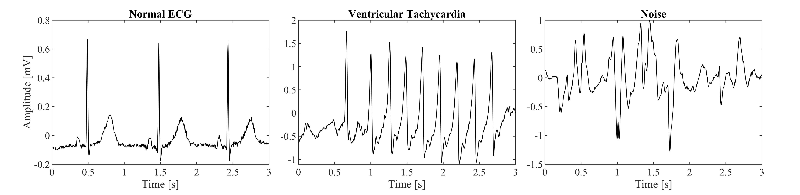

# Automatic Noise Detection for Ambulatory Electrocardiogram in Presence of Ventricular Arrhythmias Through a Machine Learning Approach

The "ecg_noise_detection_train" notebook partially replicates the study illustrated in the omonimous paper _“Automatic noise detection for ambulatory electrocardiogram in presence of ventricular arrhythmias through a machine learning approach” (L. Bachi et al., 2024, [DOI](https://doi.org/10.1016/j.compbiomed.2024.109288))_, which originally was conducted in MATLAB. The database is composed of noise indices (also referred to as noise _indexes_), _i.e._ different measures of the amount of noise that is affecting ECG at a given time point. Noise indices were computed on annotated 2-seconds long single-lead ECG windows. Here is an example of normal ECG, ventricular arrhythmia, and noise:

The goal of the study was to **train an effective noise detection model that does not mistake ventricular arrhythmias as noise**. That is, normal ECG and ventricular arrhythmias classified as ECG (with the outcome Y = 0) and noise properly classified as noise (Y = 1). Ventricular arrhythmias are rare events of critical importance, but could be mistaken as noise by traditional noise detection methods, as their ECG pattern can be substantially different from normal ECG. The other main objective was to determine which noise indexes are most useful for this task.

The database used in this notebook is slightly larger than the original version described in the paper, due to a few records of supraventricular tachycardia added in database C. The feature set of this database is also different from what was shown in the original publication. This version includes a higher number of features, which can be grouped in two:
- Inv-based features. In the paper, the *inv* feature was defined as signal slope inversions tied to amplitude variation over a minimum threshold set to 100 microvolts. However, the value of this tresholds was chosen arbitrarily. This version of the feature database includes a number of *inv* features computed using different thresholds values rangin from 50 microvolts (*inv50*) to 275 microvolts (*inv275*). In this notebook the most useful *inv* features for this task will be determined.
- Edp-based features. The "ECG derivative pattern index" (*edp*) was computed by combining different parameters computed as a trimmed mean of the maxima of the signal's derivative in different window lengths, using two derivative filters ([-1, 0, 1] and [-1, 1]). The feature dataset in this notebook includes additional parameters: *maaa* is the signal's maximum absolute amplitude on the whole 2s window; *maaf* is the average of the signal's maximum absolute amplitude on 0.66s windows; *maan* is the average of the signal's maximum absolute amplitude on 0.066s windows; *mDfa* is the maximum absolute derivative (computed using the [-1, 0, 1] filter) on the whole 2s window; *mDf* is the average of the maximum absolute derivative ([-1, 0, 1] filter) on 0.66s windows; *mDn* is the average of the maximum absolute derivative ([-1, 0, 1] filter) on 0.066s windows; *mDhn* is the average of the maximum absolute derivative (computed with a different filter, [-1, 1] ) on 0.066s windows. Additionally $\textit{edp} = \frac{\text{mDf}}{\text{mDn}}$, $\textit{edpc0} = \frac{\text{mDf} - 3 \text{mDn} - \text{mDhn} - 0.2 \text{mDfa}}{mDf + 3 \text{mDn} + \text{mDhn} + 0.2 \text{mDfa}}$, and $edpc = \frac{\text{mDf} - 3 \text{mDn} - \text{mDhn} - 0.2 \text{mDfa}}{\text{mDf} + 3 \text{mDn} + \text{mDhn} + 0.2 \text{mDfa}} + 0.7 \frac{\text{mmaf} - \text{maan} - \text{maaa}}{\text{maaf} + \text{maan} + \text{maan}}$.

The other features in this database are relative power in the QRS complex (*rpow*), relative power in the baseline (*bas*), kurtosis (*kur*), skewness (*skew*), signal-to-noise ratio (*snr*), and high order statistic (*hos*). References: [Li 2007](http://dx.doi.org/10.1088/0967-3334/29/1/002), [Clifford 2012](http://dx.doi.org/10.1088/0967-3334/33/9/1419), [Elgendi 2016](http://dx.doi.org/10.3390/bioengineering3040021), [Nardelli 2020](http://dx.doi.org/10.1016/j.bspc.2019.101666).

In the "ecg_noise_detection_train_low_power" notebook, two models intended to be used in low-power settings were trained. In this setting, only a subset of the features of the database will be used, as only the features that a) can be computed with low computational resources and b) were shown to be effective in the "ecg_noise_detection_train" notebook are used. The performances of the models using a reduced feature set are expected to be be lower.

As the part of the original ECG database is private, this notebook will only feature script outputs. The database will not be shared.
